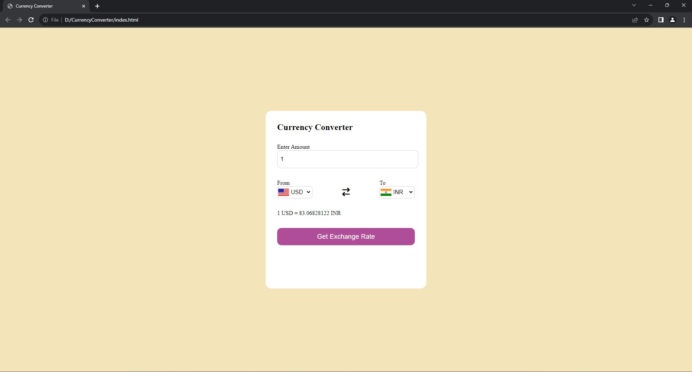

# Currency Converter

-> Allow users to input an amount in one currency and select the target currency for conversion. Implemented JavaScript

-> logic to dynamically convert the input amount based on the current exchange rates.

**Technologies used:** HTML, CSS, JavaScript and VS Code.

## snapshot

